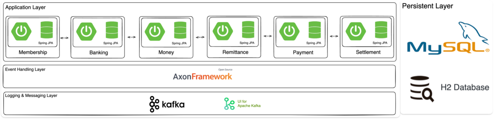
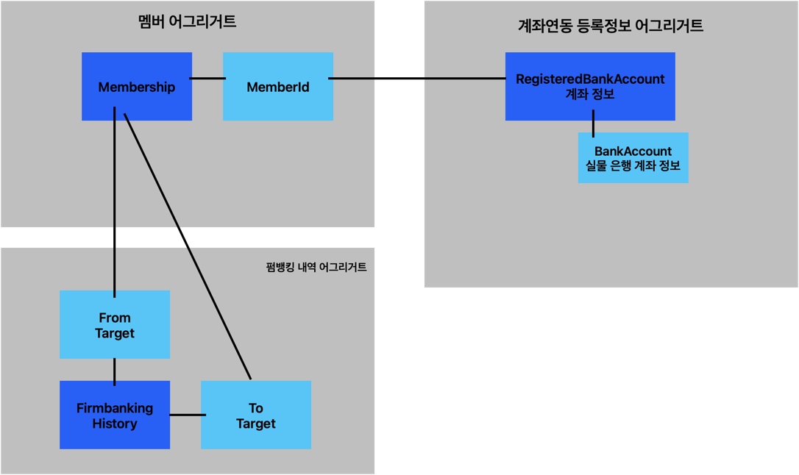
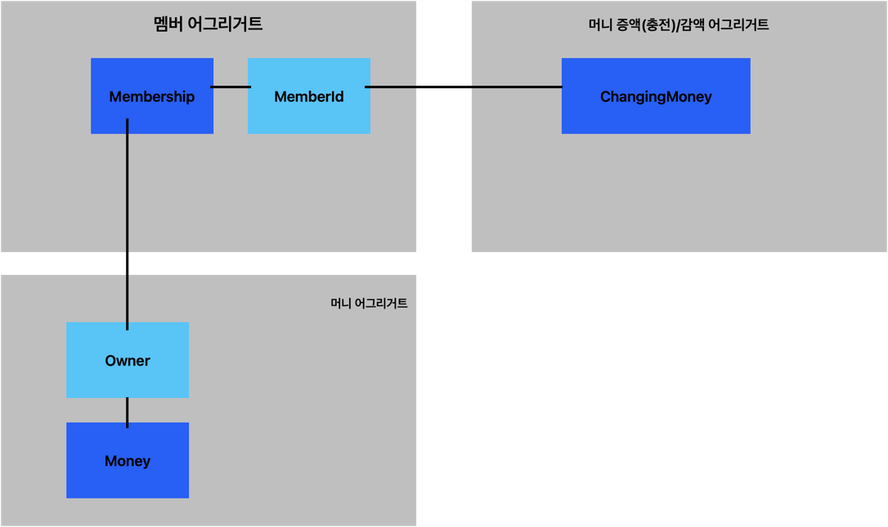
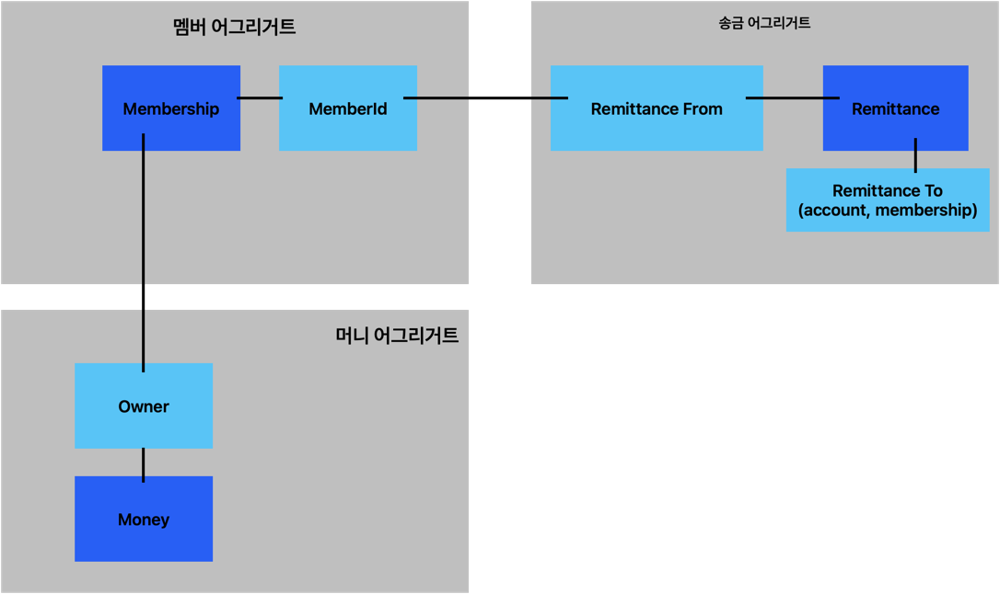
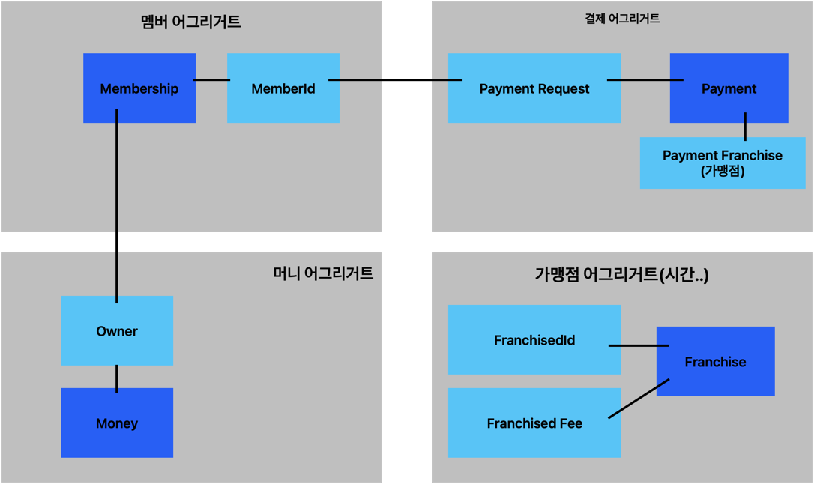
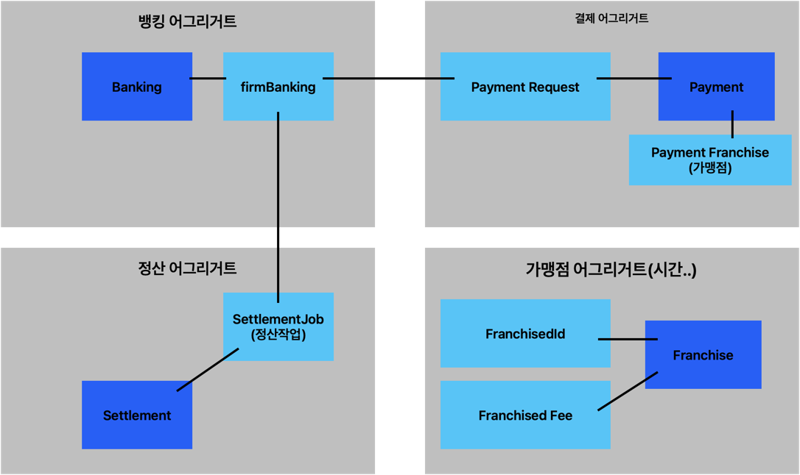

# 간펼결제 MyPay Project

일반적인 간편결제 도메인을 주제로, MSA 아키텍쳐 형태로 서비스를 구성한 MVP Project이다.

회원(Membership), 뱅킹(Banking), 머니(Money), 송금(Remittance), 결제(Payment), 정산(Settlement) 6개의 독립적인 서비스로 구성되어 있다.

각 서비스에서는 기본적인 기능을 먼저 Hexagonal Architecture 로 구현하고, 일부 기능들에 EDA, Event Sourcing, Saga Pattern 등을 적용하였다.

Springboot 2.5.2와 Java 11 을 기준으로 프로젝트를 구성하고, EDA 구현을 위해서 Axon Framework v4.6.0 을 사용했다.

로깅 파이프라인은 따로 구성하진 않았지만, AOP를 사용하여 kafka로 log 메세지 발행하는 aspect 구현

## Architecture


## Membership Service
고객의 회원 가입, 회원 정보 변경, 회원 정보 조회 등의 기능을 제공하는 서비스
  - Hexagonal Architecture 를 활용하여 기본적인 Membership Service 를 구현
  - gradle build tool 을 이용하여 Docker build 연동. 추가적인 Membership Service 를 구현 (회원 정보 변경)
  - Axon Framework 를 이용하여 Event Driven Architecture 로 리팩토링. 
  - 고객 정보가 변경될 경우, 이벤트를 발행하고, 이를 구독하는 Money 서비스 에서 고객의 머니 정보를 변경하는 CQRS 패턴 구현 (with/ AWS DynamoDB)
  -  보안을 위해 JWT 를 이용한 간단한 API 인증 구현

### API Lists
- registerMembership 멤버십 등록 
- modifyMembershipByMemberId (CQRS Trigger) 멤버십 정보 수정 
- findMembershipByMemberId 멤버십 조회
- loginByMembershipIdPw 로그인
- validateToken 토큰 유효성 인증 

#### Using Stack
  - Spring Boot, Java 11, Spring Data JPA, H2, Mysql, Lombok, Gradle, JWT, Axon Framework, Docker, Docker Compose, AWS DynamoDB

## Banking Service
고객의 계좌 정보 등록, 등록된 계좌 정보 조회, 입/출금, 거래내역 조회 등의 기능을 제공하는 서비스입니다.
  - Hexagonal Architecture 를 활용하여 기본적인 Banking Service 를 구현 (가상의 법인 계좌 및 고객 계좌 정보 등록, 은행으로 입/출금 요청하기)

### domain

  
### API Lists
- registerBankAccountByEvent 고객 계좌 등록 
- updateBankAccountByEvent 고객 계좌 수정 
- findRegisteredBankingAccountByMemberId 계좌 정보 조회

#### Using Stack
  - Spring Boot, Java 11, Spring Data JPA, H2, Mysql, Lombok, Gradle, JWT, Axon Framework, Docker, Docker Compose

## Money Service
고객의 충전 잔액(머니) CRUD, 충전 내역 조회 등의 기능을 제공하는 서비스입니다.
  - Hexagonal Architecture 를 활용하여 Membership 서비스 및 Banking 서비스를 이용하는 충전 잔액(머니)을 충전하는 기능 구현
  - 충전 내역 조회 기능 구현
  - 충전 잔액(머니) 충전 프로세스를 Async 방식으로 구현하고, Polling 을 통한 결과 조회 방식 구현
  - 충전 잔액(머니)을 충전하는 기능은 Axon Framework 를 이용하여 Saga Pattern 적용 및 리팩토링
  - Axon Framework 를 이용하여 Event Driven Architecture 로 리팩토링.

### domain


### API Lists
- createMemberMoneyByEvent 멤버 머니 생성 
- findMemberMoneyListByMembershipIds 멤버 머니 리스트 조회 
- increaseMoneyChangingRequestByEvent 멤버 머니 증가 (사가패턴사용, http 조회, 증감되면 crqr 조회용 쿼리 저장)
- decreaseMoneyChangingRequestByEvent 멤버 머니 감소

#### Using Stack
- Spring Boot, Java 11, Spring Data JPA, H2, Mysql, Lombok, Gradle, JWT, Axon Framework, Docker, Docker Compose, Kafka, Kafka-ui, Zookeeper, AWS DynamoDB

## Remittance Service
고객 간 송금 기능 및 송금 내역 정보 조회 등의 기능을 제공하는 서비스입니다.
  - Hexagonal Architecture 를 활용하여 Membership 서비스, Banking 서비스, Money 서비스를 이용하는 고객 간 혹은 계좌 송금 기능 구현
  - 고객 간 송금하는 기능은 기능은 Axon Framework 를 이용하여 Saga Pattern 적용 및 리팩토링

### domain


### API Lists
- findMoneyChangingRequest 송금 조회 
- requestRemittance 송금 

#### Using Stack
- Spring Boot, Java 11, Spring Data JPA, H2, Mysql, Lombok, Gradle, JWT, Axon Framework, Docker, Docker Compose, AWS DynamoDB

## Payment Service 
가맹점에서 MyPay 를 이용한 간편 결제 및 결제 내역 조회 등의 기능을 제공하는 서비스입니다.
  - Hexagonal Architecture 를 활용하여 Membership 서비스, Money 서비스를 이용하는 가맹점에서의 결제 기능 구현
  - Membership Service 의 가맹점주 기능 확장 

### domain


### API Lists
- requestPayment 페이먼트 생성(충전 확인, 멤버십, 머니 유효성 확인 코드 추가)
- findPaymentByPaymentId 페이먼트 조회 
- listPaymentsByPeriod 페이먼트 리스트 조회 


#### Using Stack
- Spring Boot, Java 11, Spring Data JPA,  Mysql, Lombok, Gradle, Axon Framework, Docker, Docker Compose

## money query Service
지역별로 머니 잔액을 조회하기 위한 서비스 
  - Hexagonal Architecture 를 활용하여 지역벌 머니 잔액 조회 서비스 구현.
  - dynamoDB조회

### API Lists
- SettlementJob 정산 진행 


#### Using Stack
- Spring Boot, Java 11, Spring Data JPA, Mysql, Lombok, Gradle, JWT, Axon Framework, Docker, Docker Compose

## Settlement Service
완료된 결제 내역을 기준으로 가맹점에 정산된 금액을 입금하고, 수수료 수취를 위한 기능을 제공하는 서비스입니다.
- Hexagonal Architecture 를 활용하여 Payment 서비스를 이용하는 정산 기능 구현.
- 가맹점주 정산 입금 기능 구현.

### domain


### API Lists
- SettlementJob 정산 진행 

#### Using Stack
- Spring Boot, Java 11, Spring Data JPA, Mysql, Lombok, Gradle, JWT, Axon Framework, Docker, Docker Compose

## Trouble Shooting
### 1. gradle build(docker build) 시, dockerPrepare 단계에서 error 가 발생하는 경우
```
./gradlew --stop
./gradlew docker
```

### 2. Test 실행 시, "class not found" 발생 시 gradle clean 
```
./gradlew clean
```

